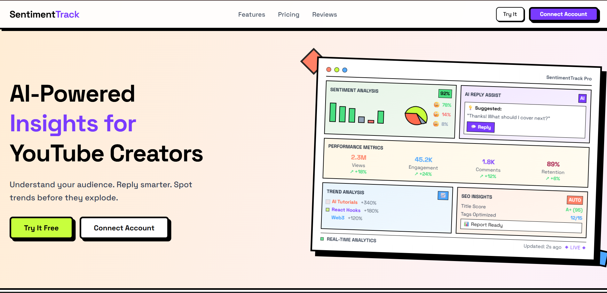
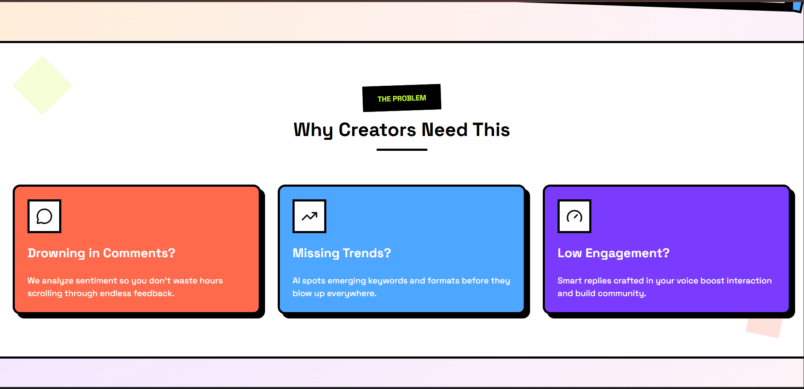
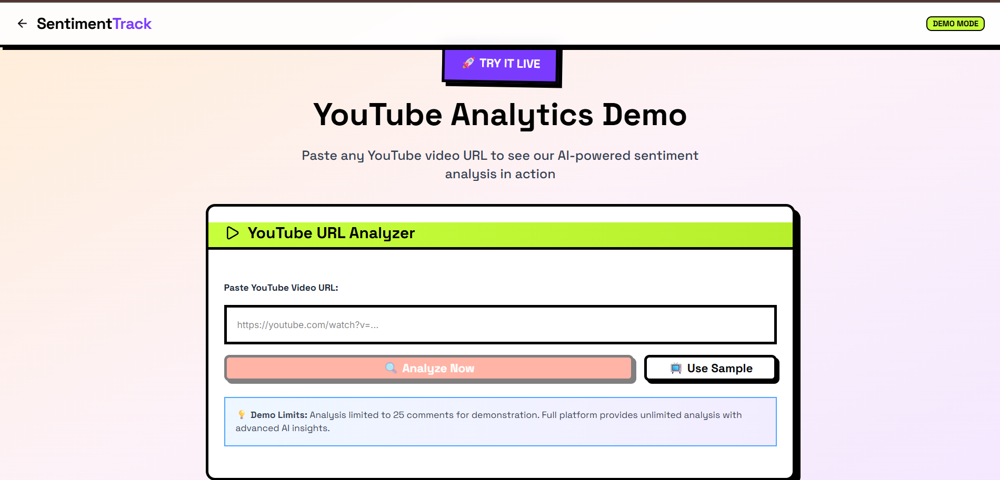
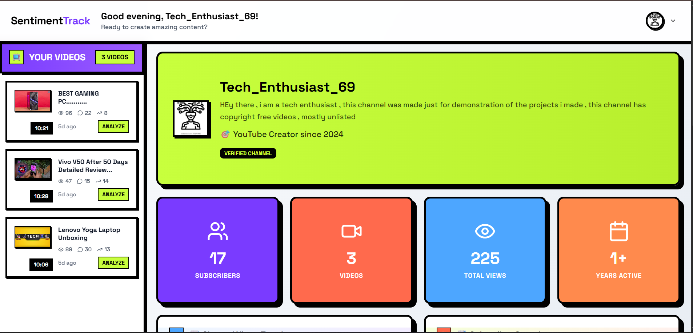
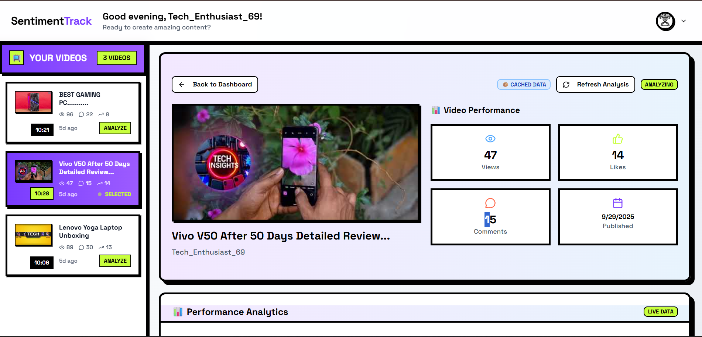
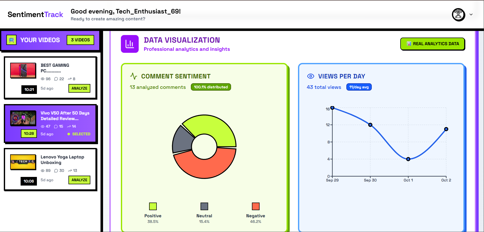
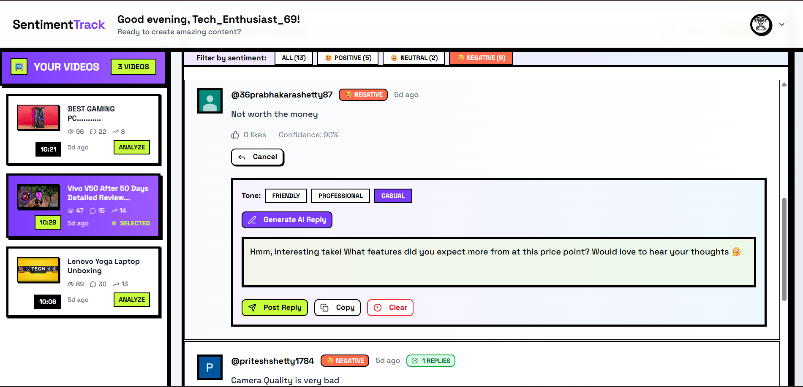
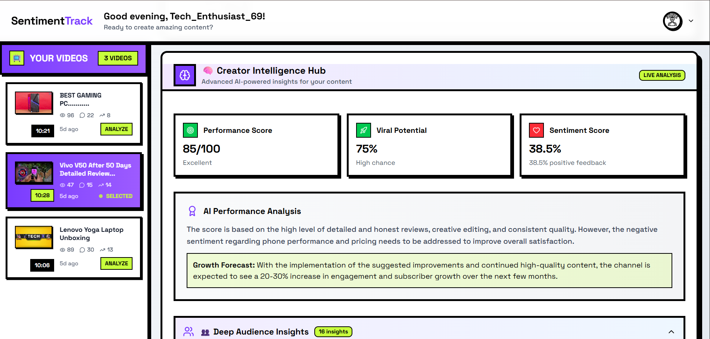

# SentimentTrack

> **AI-powered YouTube comment sentiment analysis that actually helps creators understand their audience**

SentimentTrack takes the chaos of YouTube comments and turns it into clear, actionable insights. No more scrolling through hundreds of comments wondering what your audience really thinks - just connect your youtube account and get instant sentiment analysis powered by AI.

<div align="center">

[](https://nextjs.org)
[](https://groq.com)
[](https://developers.google.com/youtube/analytics)

</div>

---

## 🤔 Why SentimentTrack?

As a creator, you've probably been there - you upload a video, get hundreds of comments, but you have no idea if people actually liked it or not. Reading through every comment takes forever, and you miss the important patterns.

**The problem?** YouTube's basic analytics tell you *how many* people commented, but not *what they actually think*.

**SentimentTrack's solution?** Advanced AI that reads all your comments, understands the emotions behind them, and gives you a clear picture of your audience's sentiment in seconds.

---

## ✨ What it actually does

### 🧠 **Smart Sentiment Analysis**
- **Groq LLaMA 3.3** analyzes every comment for emotion and meaning
- Handles multiple languages (English, Hindi, Spanish, and more)
- Understands context, sarcasm, and cultural nuances
- Categorizes feedback as positive, negative, or neutral

### 📊 **Visual Analytics Dashboard**
- Pie charts showing sentiment distribution
- Real-time comment processing with live updates
- Performance metrics that actually matter
- View trends and engagement patterns

### 🤖 **AI Reply Assistant**  
- **Mistral AI** generates contextual replies to comments
- Maintains the context of the video 
- Supports multiple languages automatically
- Learns from your video content for better responses

### 🎯 **Content Intelligence**
- Identifies what your audience loved (and didn't love)
- Discovers trending topics from comments
- Suggests improvements based on feedback
- Tracks audience satisfaction over time

---

## 🎬 See it in action

<div align="center">
<div style="overflow-x: auto; white-space: nowrap; padding: 20px; background: linear-gradient(135deg, #7A3BFF 0%, #C8FF3D 100%); border-radius: 15px; margin: 20px 0;">








</div>
</div>

---

## 🧬 How the AI works

### **The Two-Brain Approach**

**🦙 Groq LLaMA 3.3** - *The Sentiment Expert*
- Processes comments in batches for speed
- Understands cultural context and slang
- Detects emotions beyond just positive/negative
- Works with multilingual content seamlessly

**🎭 Mistral Large** - *The Reply Genius*  
- Generates authentic, human-like responses
- Adapts to your channel's personality 
- Uses video context for smarter replies
- Maintains consistent tone across languages

### **The Process**
1. **Extract** → Grab all comments from any YouTube video
2. **Analyze** → LLaMA processes sentiment and emotion patterns
3. **Visualize** → Transform data into clear charts and insights  
4. **Generate** → Mistral creates reply suggestions when needed
5. **Learn** → System improves based on audience engagement patterns

---

## 🚀 Quick Start

### **setup** 
```bash
# Clone and install
git clone <repo-url>
cd sentimenttrack
npm install

# Get your API keys ready
cp .env.example .env.local
# Fill in the keys (see setup guide below)

# Launch
npm run dev
```

### **Need API keys?**
📋 **[Complete Setup Guide](./SETUP.md)** - Everything you need to get Groq, Mistral, and YouTube APIs working

---

## 🎯 Who uses SentimentTrack?

### **🎬 YouTube Creators**
- "Finally understand what my audience actually thinks"
- "Save hours of reading comments manually"
- "Make better content based on real feedback"

### **📱 Content Teams**
- "Track sentiment across multiple videos"
- "Generate replies that match our brand voice"
- "Identify trending topics from audience comments"

### **🔍 Researchers & Students**
- "Analyze social media sentiment at scale"
- "Study audience behavior patterns"
- "Perfect for sentiment analysis projects"

---


## 🛠️ Built with

- **Next.js 15** - Modern React framework with server components
- **Groq API** - Lightning-fast LLaMA inference
- **Mistral AI** - Advanced language understanding
- **YouTube Data API** - Official Google integration
- **Tailwind CSS** - Neo-brutalist design system

---
<div align="center">
<sub>Built with curiosity to help creators better understand their audience</sub>
</div>

